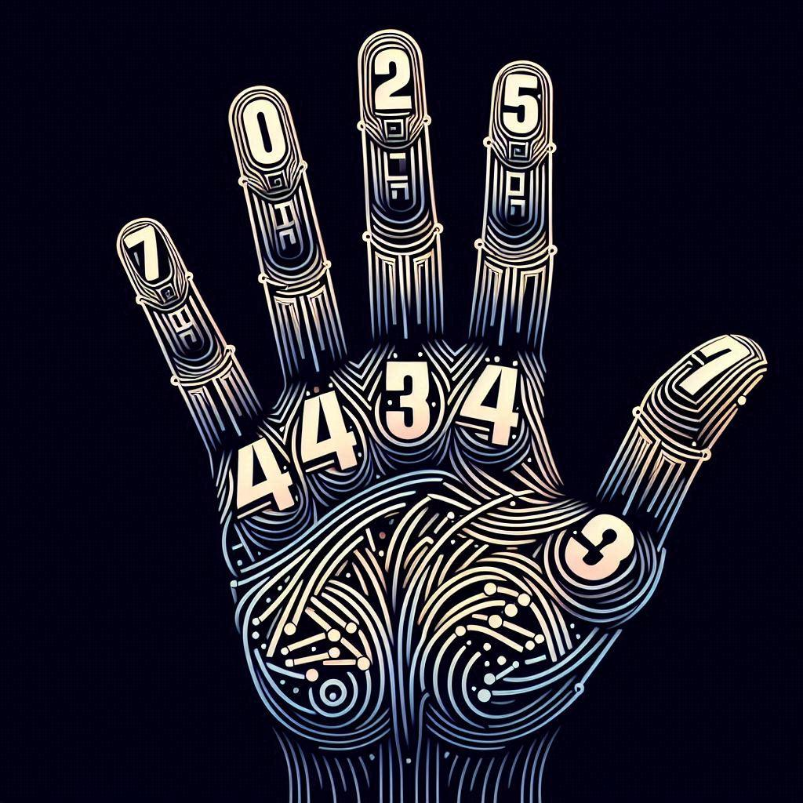

# NumWiz: Real-Time Hand Gesture Number Recognition

<div align="center">
  
</div>

This project, developed as part of the Machine Learning course in the Master's Degree in Computer Science at the University of Catania, implements three machine learning models for real-time recognition of numbers performed with hand gestures. The models are designed to accurately interpret finger gestures, identifying numbers from 0 to 10 shown by the user in front of a webcam.

## 🎯 Project Objectives
1. Apply machine learning techniques studied during the course to a practical computer vision problem
2. Compare the effectiveness of different approaches to gesture recognition
3. Develop a functional application that can be used in real-world scenarios
   
## 🤖 Models Implemented
This project implements and compares three different approaches to hand gesture number recognition:
1. **Simple MLP (Multi-Layer Perceptron):**
   1. Trained on hand landmarks captured from user input
2. **ResNet18 and ResNet34 (with our images):**
   1. Pre-trained models adapted to our specific use case
   2. Fine-tuned using our custom dataset of hand gesture images
3. **ResNet18 and ResNet34 (with Hagrid dataset):**
   1. Pre-trained models fine-tuned using the [HAGRID](https://github.com/hukenovs/hagrid) dataset
   2. Leverages the HAnd Gesture Recognition Image Dataset (HAGRID), a large-scale dataset for hand gesture recognition
   3. The use of the HAGRID dataset in the third approach allows us to benefit from a diverse and extensive collection of hand gesture images, potentially improving the model's generalization capabilities.

## 🏋🏼 Training
To Train the three models implemented in this project, you need to execute one of the following commands, depending on the model you want to train:
### ✋🏼 MLP for landmarks
- Before training the models, you need to create the hand landmarks dataset:
```bash
cd NumWiz/script_dataset
python3 create_dataset.py
```
- To perform data augmentation and increase the size and diversity of the dataset:
```bash
python3 synthetic_data.py
```
- Now you can Train the model
```bash
cd NumWiz/Training
python3 train_csv.py
```
> The ```synthetic_dataset.csv``` is located in https://www.kaggle.com/datasets/mancisee/synthetic-landmarks

### 🕳️ ResNet18 and ResNet34
- Before training the models, you need to create the hand images dataset. You have to recording video of your hands and run this script to collect the frames:
```bash
cd NumWiz
python3 createdatasetdelay.py
```
- Collect as many images as possible, then run this script to split the dataset and start the Training:
```bash
cd NumWiz
python3 createdatasetdelay.py
```
- Now you can Train the model
```bash
cd NumWiz/Training
python3 train_resnet18.py
python3 train_resnet34.py
```
> ❗️ If you want to use the Hagrid dataset, you can use [our version](https://www.kaggle.com/datasets/mancisee2/splitted-hagrid/) with approximately 2000 images for training and 1000 for testing. Otherwise, if you need more or fewer images, you'll need to download the official dataset and then run the ```crop_hagrid.py``` script, selecting the desired number of images.

> Our hands dataset can be found here https://www.kaggle.com/datasets/mancisee/hands-cropped-split/data

## 👨🏼‍💻 Testing
To Test the three models implemented in this project, you need to execute one of the following commands, depending on the model you want to Test (if you want to test the models after retraining, you need to change the weight paths):
### ✋🏼 MLP for landmarks
```bash
cd NumWiz/Testing
python3 hand_landmarks.py
```
### 🕳️ ResNet18 and ResNet34
```bash
cd NumWiz/Testing
python3 hand_resnet18_our.py
python3 hand_resnet34_our.py
python3 hand_resnet18_hagrid.py
python3 hand_resnet34_hagrid.py
```
> ⚠️ Before running any script, make sure to update the relative paths according to your specific directories.

## 📀 Demo

https://github.com/ManciSee/NumWiz/assets/80248296/7e40ea88-5d49-4aac-90e0-be4e71b24d24

https://github.com/ManciSee/NumWiz/assets/80248296/a1d5a988-3ae8-4fb9-bd8c-af42e933411b

## 👥 Authors
<a href="https://github.com/ManciSee">
  
</a>
<a href="https://github.com/enrysorb">
  
</a>
<a href="https://github.com/pyMelo">
  
</a>

